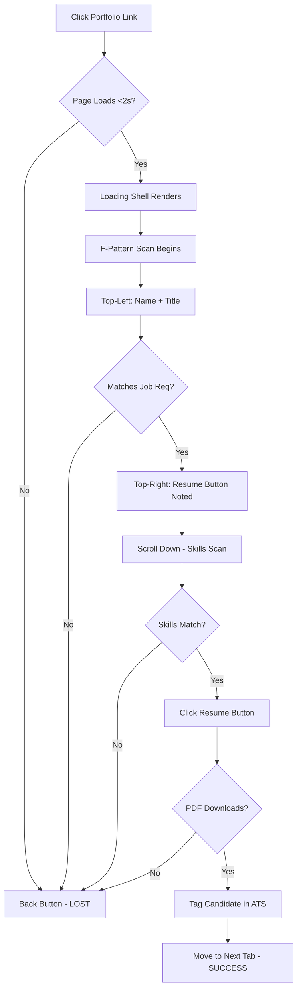
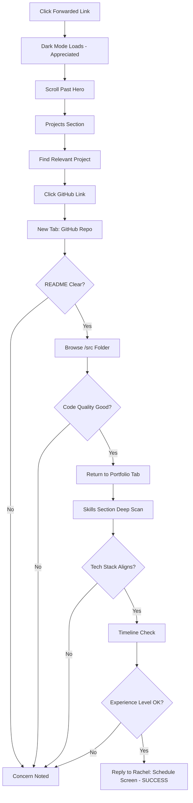
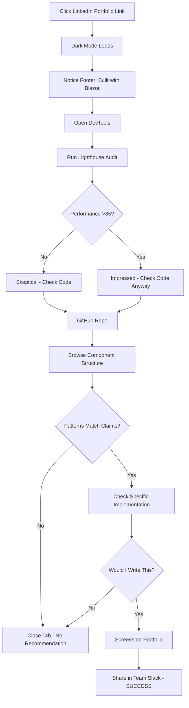
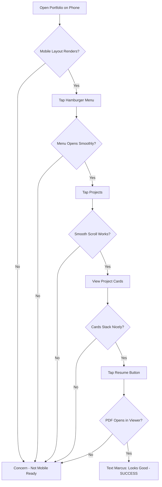

# UX Design Specification - Bhavan Portfolio

**Author:** Bhavan
**Date:** 2026-01-04

---

## Executive Summary

### Project Vision

A minimalist, Apple-inspired developer portfolio that demonstrates technical competence through clean execution rather than flashy features. Built with Blazor WebAssembly, Tailwind CSS, and hosted on GitHub Pages, the portfolio embodies a "less is more" philosophy where the codebase itself serves as proof of the qualities being claimed.

The portfolio positions Bhavan as a Full Stack Developer who gets things done - reliable, clean code, fast delivery, and technical depth.

### Target Users

| User | Role | Goal | Success Statement |
|------|------|------|-------------------|
| **Rachel** | Technical Recruiter | Quick validation in 8-15 seconds | "This looks clean, skills match, projects are relevant - downloading resume now." |
| **Marcus** | Engineering Hiring Manager | Technical validation, team fit assessment | "The code matches the claims. Schedule the technical screen." |
| **Dev** | Peer / Referrer | Assess credibility for referral | "Clean architecture, good patterns. Worth recommending." |

**Primary Focus:** Rachel's 8-second decision journey. All design choices optimize for the recruiter scan pattern.

### Key Design Challenges

1. **8-Second Test** - Name, title, and resume download must be findable instantly via F-pattern eye scan (top-left → top-right → scroll down)
2. **Dual Theme Polish** - Dark and light modes must be equally refined; light mode is not an afterthought
3. **WASM Loading Experience** - 2-5MB runtime download requires styled loading state to prevent the "back button moment"
4. **Minimalist Visual Hierarchy** - Create visual interest, guide attention, and establish hierarchy using only the grayscale palette (no color crutches)

### Design Opportunities

1. **Sticky Resume Download** - Primary CTA always visible, 1-click access from any scroll position
2. **Loading as Design Statement** - Static hero shell that fades seamlessly into live Blazor app, turning a technical constraint into a polished experience
3. **Code as Proof** - Prominent GitHub links position the codebase as portfolio evidence
4. **"Built with Blazor" Colophon** - Footer attribution becomes a conversation starter for developer peers

## Core User Experience

### Defining Experience

**Primary User Action:** Scan and decide - Rachel scans the hero, validates skills, downloads resume in 8-15 seconds total.

**Critical Action:** Resume download - 1-click from any scroll position via sticky header. This is the conversion moment.

**Effortless Goal:** Finding proof - Name, title, skills, projects, resume require zero hunting.

### Platform Strategy

| Platform | Priority | Experience |
|----------|----------|------------|
| **Desktop** | Primary | Full layout, sticky header with all nav items visible |
| **Mobile** | Equal | Hamburger menu, stacked cards, touch-friendly (44px targets) |
| **Tablet** | Adaptive | Responsive behavior between desktop and mobile |

**Input Method:** Mouse/keyboard primary, touch-friendly secondary
**Offline:** Not required (static site, always online)
**Browser Support:** Modern evergreen only (Chrome, Firefox, Safari, Edge - latest 2 versions)

### Effortless Interactions

| Interaction | Should Feel Like... |
|-------------|---------------------|
| Finding resume | It's just *there* - sticky header, always visible |
| Scanning skills | Glance, match, done - 5 seconds max |
| Theme toggle | Respects user agency - preference persists, context-aware |
| Navigation | Intentional scroll - 400-500ms with easing, signals quality |
| Loading | Seamless handoff - static shell pixel-identical to Blazor component |

### Critical Success Moments

| Moment | Success | Failure |
|--------|---------|---------|
| **First 3 seconds** | "This looks professional" | Back button |
| **Skills scan** | "Matches our requirements" | "Can't find relevant skills" |
| **Resume click** | PDF downloads instantly | Broken link, slow download |
| **Mobile check** | "Works perfectly on phone" | Broken layout, tiny tap targets |
| **Theme toggle** | Smooth transition, preference remembered | Flash, resets on reload |
| **Scroll navigation** | Intentional, quality feel (400-500ms eased) | Jarring jump or sluggish crawl |

### Time-Bucketed Design (Rachel's 8-Second Journey)

| Time Bucket | UX Goal | What Earns Attention |
|-------------|---------|---------------------|
| **0-1.5s** | Professional first impression | Loading shell renders, clean B&W aesthetic |
| **1.5-3s** | "I know who this person is" | Name (top-left), Title, Resume button (top-right) |
| **3-6s** | "Matches my job req" | Skills section - scannable badges |
| **6-8s** | Decision & action | Resume downloaded or tab closed |

*Note: Projects, Timeline, Contact serve Marcus and Dev who go deeper. Rachel may never scroll past Skills.*

### Experience Principles

1. **Time-Bucketed Design** - Each 2-second window has a specific UX goal; every element earns its place in that window
2. **Prove, Don't Claim** - GitHub links, clean code, performance scores speak louder than words
3. **Zero Friction Download** - Resume is the primary CTA, always accessible, 1-click from anywhere
4. **Respect User Agency** - Theme preference persists, context-aware defaults, user choice honored
5. **Seamless Handoff** - Static loading shell pixel-identical to Blazor component; zero visual shift on hydrate
6. **Intentional Micro-Interactions** - Scroll behavior (400-500ms eased), transitions, and animations all signal quality

## Desired Emotional Response

### Primary Emotional Goals

| User | Should Feel | Why It Matters |
|------|-------------|----------------|
| **Rachel** | **Confident** | "I can trust this candidate is worth my time" |
| **Marcus** | **Impressed** | "This person knows what they're doing" |
| **Dev** | **Respect** | "Clean work. I'd recommend them." |

**The Core Emotion:** **Professional Trust** - Not flashy excitement, but quiet confidence. The feeling you get from a well-organized desk, a firm handshake, a person who means what they say.

### Emotional Journey Mapping

| Stage | Rachel's Emotion | Design Driver |
|-------|------------------|---------------|
| **First impression (0-3s)** | Relief → "Finally, a clean one" | Minimalist aesthetic, fast load |
| **Scanning (3-6s)** | Confidence → "Skills check out" | Scannable badges, clear hierarchy |
| **Decision (6-8s)** | Satisfaction → "Easy to act on" | 1-click resume, no friction |
| **After download** | Trust → "Professional choice" | Clean PDF, consistent branding |

### Micro-Emotions

**Emotions to Cultivate:**

| Emotion | How We Create It |
|---------|------------------|
| **Confidence** | Clear typography, consistent spacing, no visual noise |
| **Trust** | Professional aesthetic, working links, instant feedback |
| **Efficiency** | Zero hunting, information where expected, fast interactions |
| **Respect** | Attention to detail in both themes, polished micro-interactions |

**Emotions to Avoid:**

| Avoid | Cause | Prevention |
|-------|-------|------------|
| **Frustration** | Slow load, broken links, hunting for resume | Loading shell, sticky header, clear CTAs |
| **Confusion** | Unclear navigation, too much content | Single-page, 6 focused sections |
| **Skepticism** | Over-claiming, inconsistent quality | Let code speak, both themes polished |
| **Impatience** | Sluggish transitions, unresponsive UI | 400-500ms eased scroll, instant theme toggle |

### Emotional Design Principles

1. **Professional Trust Over Flash** - Quiet confidence through clean execution, not attention-grabbing gimmicks
2. **Relief Through Simplicity** - Rachel sees dozens of cluttered portfolios; ours is a breath of fresh air
3. **Confidence Through Consistency** - Same quality in dark mode, light mode, mobile, desktop
4. **Respect Through Speed** - Every millisecond saved says "I value your time"
5. **Trust Through Transparency** - GitHub links, open source, code speaks for itself

## UX Pattern Analysis & Inspiration

### Inspiring Products Analysis

| Product | Key UX Strengths | Applicable Patterns |
|---------|------------------|---------------------|
| **Apple.com** | Typography-driven hierarchy, whitespace mastery, dual-mode excellence | Hero typography (48-64px name), generous section padding (80-120px), loading strategy |
| **Linear.app** | Dark mode default, micro-interactions, developer focus | Theme toggle implementation, hover states, keyboard navigation |
| **Stripe.com** | Scannable content, professional polish, documentation clarity | Skills badges, project cards, information chunking |
| **Vercel.com** | B&W aesthetic, developer credibility, smooth scroll | Grayscale palette, code-as-proof, 400-500ms eased navigation |

### Transferable UX Patterns

**Navigation:**
- Sticky minimal header (name + nav + resume CTA + theme toggle)
- Smooth scroll to sections (400-500ms, eased)
- Mobile hamburger with full functionality

**Interactions:**
- Instant theme toggle (no flash, localStorage persist)
- Hover state elevation on cards (subtle lift/shadow)
- Focus indicators for keyboard navigation
- Button feedback (subtle scale/opacity)

**Visual:**
- Typography-driven hierarchy (large name, clear title levels)
- Generous whitespace (section padding 80-120px)
- Card-based content (projects, skills)
- Constrained B&W palette

**Loading:**
- Static shell matching final component
- Fade transition on hydration
- Progressive content reveal

### Anti-Patterns to Avoid

| Avoid | Reason | Prevention |
|-------|--------|------------|
| Animated backgrounds | Distracts, hurts performance | Static B&W focus |
| Color outside palette | Breaks cohesion | Strict grayscale only |
| Carousel/sliders | Hides content | Visible grid |
| Scroll hijacking | Frustrating UX | Native + smooth anchor |
| Buried resume | Fails 8-second test | Sticky header CTA |
| Light mode afterthought | Signals neglect | Both modes equally designed |
| Too much text | Recruiters scan | Badges, bullets, hierarchy |

### Design Inspiration Strategy

**Adopt:** Apple's typography hierarchy, Linear's dark mode excellence, Vercel's B&W aesthetic, Stripe's scannable organization

**Adapt:** Loading patterns for WASM shell, navigation for single-page, card design for grayscale

**Avoid:** Non-functional animation, off-palette colors, friction-adding interactions, theme inconsistency

## Design System Foundation

### Design System Choice

**Custom Design System with Tailwind Foundation**

A custom component system built on Tailwind CSS v4 utility classes, designed specifically for Blazor WebAssembly with strict B&W aesthetic constraints.

### Rationale for Selection

| Factor | Decision Driver |
|--------|-----------------|
| **Framework Alignment** | Blazor components (`.razor`) require custom implementation - no React/Vue component libraries apply |
| **Aesthetic Control** | Strict grayscale palette (black, white, grays only) - no library defaults to fight against |
| **Performance** | Zero unused component library code - only what we build ships |
| **Simplicity** | No additional dependencies or API learning curves beyond Tailwind utilities |
| **Maintainability** | Single developer project - custom is manageable and fully understandable |

### Implementation Approach

| Layer | Tool | Responsibility |
|-------|------|----------------|
| **Design Tokens** | `tailwind.config.js` + CSS custom properties | Colors, fonts, spacing, breakpoints |
| **Utility Classes** | Tailwind CSS v4 | Layout, typography, responsive, dark mode |
| **Components** | Custom Blazor `.razor` files | ProjectCard, SkillBadge, TimelineItem, etc. |
| **Theme Switching** | CSS custom properties + Tailwind `dark:` variants | Dark/light mode via body class |

### Customization Strategy

**Design Tokens (defined in Tailwind config):**

| Token Category | Values |
|----------------|--------|
| **Colors** | black, white, gray-50, gray-200, gray-300, gray-400, gray-600, gray-700, gray-800, gray-900 |
| **Typography Scale** | text-sm, text-base, text-lg, text-xl, text-2xl, text-4xl, text-5xl, text-6xl |
| **Spacing Scale** | Tailwind default (4px base) |
| **Breakpoints** | sm: 640px, md: 768px, lg: 1024px, xl: 1280px |

**Component Pattern Library:**

| Component | Styling Pattern |
|-----------|-----------------|
| **Buttons** | Solid fill (primary CTA) vs outline (secondary) - grayscale only |
| **Cards** | Border + subtle shadow, hover elevation |
| **Badges** | Pill-shaped, border or filled background |
| **Section Containers** | py-20 to py-32 (80-128px), max-w-6xl centered |
| **Typography** | System font stack, clear weight hierarchy |

**Theme Implementation:**
- Tailwind `darkMode: 'class'` configuration
- Body class: `dark` or `light`
- All components use `dark:` variant utilities
- CSS custom properties for any non-Tailwind values

## Defining Experience

### Core Interaction

**"Scan → Validate → Download"**

Rachel lands on the page, scans the hero (name, title), validates skills match, downloads resume. Total time: 8 seconds.

*If a friend asked: "What's that portfolio site?" → "Clean developer portfolio - I could find everything in seconds and download his resume instantly."*

### User Mental Model

**How recruiters currently solve this:**
- LinkedIn profiles (structured, but generic)
- PDF resumes (portable, but no context)
- Personal websites (varied quality, often slow or confusing)

**Mental model Rachel brings:**
- "I scan, I don't read"
- "Resume button should be obvious"
- "Skills should be at a glance"
- "If I can't figure it out in 10 seconds, next candidate"

| Expectation | Our Design |
|-------------|------------|
| Name + title visible immediately | Hero section, largest typography |
| Resume accessible without hunting | Sticky header, always visible |
| Skills scannable quickly | Badge-based, no paragraphs |
| Works on mobile | Full responsive parity |

### Success Criteria

| Criteria | Measurement |
|----------|-------------|
| **"This just works"** | Zero confusion, F-pattern delivers expected info |
| **Feels fast** | Loading shell < 500ms, full interactive < 5s |
| **Accomplishment** | Resume downloaded in 1 click, no hunting |
| **Smart feedback** | Smooth scroll confirms navigation, theme toggle is instant |

**Rachel Success Statement:** "I found what I needed without thinking about it."

### Pattern Analysis

**100% Established Patterns** - No user education needed:

| Pattern | Source | Our Implementation |
|---------|--------|-------------------|
| Sticky header with CTA | Every SaaS site | Name + Nav + Resume + Theme |
| Single-page scroll | Portfolio standard | 6 sections, smooth anchor |
| Card-based projects | Universal pattern | ProjectCard component |
| Dark/light toggle | Linear, Vercel, GitHub | Icon toggle, localStorage |
| Badge-style skills | LinkedIn, GitHub | SkillBadge component |

**Differentiation:** Not novel interaction - execution quality within established patterns.

### Experience Mechanics

**1. Initiation (0-1.5s)**
- User clicks link (LinkedIn, job application, Google)
- Loading shell renders immediately (static HTML hero)
- B&W aesthetic establishes tone before Blazor loads

**2. Interaction (1.5-6s)**
- F-pattern scan: Name (top-left) → Resume button (top-right) → Scroll down
- Nav click: smooth scroll (400-500ms eased) to section
- Theme toggle: instant class switch, localStorage persist
- Passive scrolling reveals sections in order

**3. Feedback**
- Resume click: Browser download dialog (instant)
- Nav click: Smooth scroll animation confirms action
- Theme toggle: Immediate visual change, no flash
- Hover states: Cards elevate, buttons respond
- Error state (WASM fail): Fallback message after 10s

**4. Completion (6-8s)**
- Success: Resume downloaded, positive impression
- Deeper engagement (Marcus/Dev): Projects → GitHub links
- Exit: Tab closed, but impression made

## Visual Design Foundation

### Color System

**Constrained Palette:**

| Color | Value | Usage |
|-------|-------|-------|
| `black` | #000000 | Text (dark mode), backgrounds (light mode CTAs) |
| `white` | #FFFFFF | Backgrounds (light mode), text (dark mode) |
| `gray-50` | #F9FAFB | Light mode background alternative |
| `gray-200` | #E5E7EB | Borders (light mode), dividers |
| `gray-300` | #D1D5DB | Muted elements (light mode) |
| `gray-400` | #9CA3AF | Secondary text (light mode) |
| `gray-600` | #4B5563 | Secondary text (dark mode) |
| `gray-700` | #374151 | Borders (dark mode) |
| `gray-800` | #1F2937 | Card backgrounds (dark mode) |
| `gray-900` | #111827 | Page background (dark mode) |

**Semantic Mapping:**

| Semantic | Dark Mode | Light Mode |
|----------|-----------|------------|
| **Background** | gray-900 | white |
| **Surface** (cards) | gray-800 | gray-50 |
| **Text Primary** | white | black |
| **Text Secondary** | gray-400 | gray-600 |
| **Border** | gray-700 | gray-200 |
| **Primary CTA** | white bg, black text | black bg, white text |
| **Secondary CTA** | border-white, white text | border-black, black text |

### Typography System

**System Font Stack:**
```css
font-family: -apple-system, BlinkMacSystemFont, "Segoe UI", Roboto, "Helvetica Neue", Arial, sans-serif;
```

**Type Scale:**

| Element | Size | Weight | Usage |
|---------|------|--------|-------|
| **Hero Name** | text-5xl (48px) / md:text-6xl (60px) | font-bold (700) | Name in hero |
| **Hero Title** | text-xl (20px) / md:text-2xl (24px) | font-normal (400) | "Full Stack Developer" |
| **Section Heading** | text-3xl (30px) / md:text-4xl (36px) | font-semibold (600) | About, Skills, Projects, etc. |
| **Card Title** | text-xl (20px) | font-semibold (600) | Project names |
| **Body Text** | text-base (16px) | font-normal (400) | Paragraphs, descriptions |
| **Small Text** | text-sm (14px) | font-normal (400) | Badges, timestamps |
| **Nav Links** | text-sm (14px) | font-medium (500) | Header navigation |

**Line Heights:** Headings: `leading-tight` (1.25) | Body: `leading-relaxed` (1.625)

### Spacing & Layout Foundation

**Spacing Scale (4px base):**

| Token | Value | Usage |
|-------|-------|-------|
| `space-1` | 4px | Tight gaps (badge padding) |
| `space-2` | 8px | Small gaps (between badges) |
| `space-4` | 16px | Medium gaps (card padding) |
| `space-6` | 24px | Large gaps (between elements) |
| `space-8` | 32px | Section internal spacing |
| `space-20` | 80px | Section padding (py-20) |
| `space-32` | 128px | Large section padding (py-32) |

**Layout Grid:**

| Breakpoint | Container | Columns |
|------------|-----------|---------|
| Default | `max-w-6xl` (1152px) | 1 column (stacked) |
| `md:` (768px+) | `max-w-6xl` | 2 columns |
| `lg:` (1024px+) | `max-w-6xl` | 3 columns |

**Section Structure:**
- All sections: `py-20 md:py-32` (80-128px vertical padding)
- Container: `max-w-6xl mx-auto px-4 md:px-6`
- Hero: Full viewport height (`min-h-screen`)

### Accessibility Considerations

| Requirement | Implementation |
|-------------|----------------|
| **Contrast Ratio** | All text meets WCAG AA (4.5:1 minimum) |
| **Focus Indicators** | Visible focus rings on all interactive elements |
| **Touch Targets** | Minimum 44x44px for mobile |
| **Font Size** | Base 16px, scalable with user preferences |
| **Color Independence** | No information conveyed by color alone |
| **Reduced Motion** | Respect `prefers-reduced-motion` for animations |

## Design Direction Decision

### Design Directions Explored

Three primary layout directions were evaluated for the Bhavan Portfolio:

| Direction | Approach | Key Characteristics | Verdict |
|-----------|----------|---------------------|---------|
| **A: Classic Hero** | Full-viewport centered hero with name, title, and dual CTAs | Strong first impression, clear hierarchy, immediate F-pattern scan | Excellent for 8-second test |
| **B: Left-Aligned Editorial** | Editorial typography with left-aligned content and sidebar navigation | Professional, typography-driven, content-focused | Too text-heavy for recruiter scan |
| **C: Minimal Grid** | Brutalist grid layout with maximum whitespace | Ultra-minimal, geometric, stark | Too sparse, lacks warmth |

### Chosen Direction

**"Hero-First with Editorial Polish"** - A hybrid approach combining:

- **From Direction A:** Full-viewport hero with centered name/title, dual CTA placement (hero + sticky header)
- **From Direction B:** Editorial typography treatment for section headings, generous line heights
- **From Direction C:** Disciplined whitespace in skills badges and project cards

**Interactive Mockup:** `_bmad-output/planning-artifacts/ux-design-directions.html`

### Design Rationale

| Decision | Rationale |
|----------|-----------|
| **Full-viewport hero** | Maximizes first impression, passes 8-second test, F-pattern delivers name → resume instantly |
| **Sticky header with resume CTA** | Rachel never loses access to primary action regardless of scroll position |
| **Badge-based skills** | Scannable in 3-5 seconds, matches recruiter mental model from LinkedIn |
| **Card-based projects** | Familiar pattern, hover states add polish, GitHub links provide proof |
| **Vertical timeline** | Professional history scannable, compact on mobile |
| **Theme toggle in header** | Accessible from any section, instant feedback |

### Implementation Approach

**Header Structure:**
```
┌─────────────────────────────────────────────────────────────────┐
│ Bhavan Anand    About  Skills  Projects  Experience    🌙  [Resume] │
└─────────────────────────────────────────────────────────────────┘
```
- Fixed position, backdrop blur, border-bottom
- Resume button: primary CTA styling (filled)
- Theme toggle: icon button (sun/moon)

**Hero Section:**
```
┌─────────────────────────────────────────────────────────────────┐
│                                                                 │
│                       Bhavan Anand                              │
│                    Full Stack Developer                         │
│                                                                 │
│                [Download Resume]  [View Projects]               │
│                                                                 │
└─────────────────────────────────────────────────────────────────┘
```
- `min-h-screen`, centered content
- Name: `text-5xl md:text-6xl font-bold`
- Title: `text-xl md:text-2xl text-gray-400`
- Dual CTAs: Primary (filled) + Secondary (outline)

**Section Pattern:**
- Consistent padding: `py-20 md:py-32`
- Section heading: `text-3xl md:text-4xl font-semibold` + brief subtitle
- Content: Cards, badges, or timeline based on section type

**Responsive Behavior:**
- Desktop (lg+): 3-column project grid, full nav visible
- Tablet (md): 2-column grid, condensed nav
- Mobile: Single column, hamburger menu, stacked CTAs

## User Journey Flows

### Rachel's 8-Second Decision Flow

**Entry Point:** Click from LinkedIn, job application, or email link
**Goal:** Download resume and move candidate to phone screen pile in <15 seconds



**Critical Moments:**

| Moment | Time | Success | Failure |
|--------|------|---------|---------|
| Page load | 0-2s | Shell renders, professional feel | Spinner or blank = back button |
| Identity scan | 2-4s | Name + title visible top-left | Can't find who this is |
| Skills validation | 4-8s | Relevant skills scannable | Too much text, skills buried |
| Resume action | 8-15s | 1-click download works | Button missing, broken link |

### Marcus's Technical Validation Flow

**Entry Point:** Rachel's forwarded link with note "Skills match, worth a look"
**Goal:** Decide if candidate warrants technical interview slot in <5 minutes



**Validation Points:**

| Check | Location | Pass | Fail |
|-------|----------|------|------|
| Code quality | GitHub repo | Clean patterns, organized | Messy, commented-out code |
| Tech stack | Skills section | Aligns with team needs | Missing key technologies |
| Experience | Timeline | Progressive responsibility | Gaps or stagnation |
| Architecture | README | Clear explanation | Confusing or missing |

### Dev's Peer Assessment Flow

**Entry Point:** LinkedIn connection updated profile with portfolio link
**Goal:** Assess if worth recommending for team opening



**Peer Signals:**

| Signal | Source | Respect | Skepticism |
|--------|--------|---------|------------|
| Performance | Lighthouse | 85+ on WASM is solid | <70 = claims don't match |
| Patterns | Code review | Consistent, recognizable | Inconsistent, hacky |
| Architecture | File structure | Organized, logical | Flat or chaotic |
| Decisions | README/comments | Explained, justified | Unexplained complexity |

### Rachel Redux - Mobile Validation Flow

**Entry Point:** Revisiting portfolio on phone for final review
**Goal:** Confirm candidate looks good on mobile before final round



**Mobile Checkpoints:**

| Element | Test | Pass | Fail |
|---------|------|------|------|
| Layout | Content readable | Proper responsive stacking | Broken/overlapping |
| Navigation | Hamburger menu | Smooth open/close | Janky or broken |
| Touch targets | Buttons/links | 44px+ tap areas | Too small to hit |
| Resume | Download action | Opens in phone viewer | Broken link |

### Journey Patterns

**Navigation Patterns:**
- **Sticky Header:** Always visible, provides orientation and primary CTA access
- **Smooth Scroll:** 400-500ms eased animation confirms navigation action
- **Mobile Hamburger:** Full menu functionality in compact form

**Decision Patterns:**
- **F-Pattern Layout:** Top-left identity, top-right action, scroll for details
- **Progressive Disclosure:** Hero → Skills → Projects → Timeline → Contact
- **External Validation:** GitHub links for code proof, LinkedIn for social proof

**Feedback Patterns:**
- **Instant Response:** Theme toggle, button hover states
- **Visual Confirmation:** Scroll animation, download initiation
- **Error Recovery:** Fallback message if WASM fails to load

### Flow Optimization Principles

| Principle | Implementation |
|-----------|----------------|
| **Minimize Steps to Value** | Resume accessible in 1 click from any scroll position |
| **Reduce Cognitive Load** | Scannable badges instead of paragraphs, clear visual hierarchy |
| **Clear Progress Indicators** | Scroll position via nav highlighting, section headings |
| **Graceful Error Handling** | 10-second WASM timeout with fallback message |
| **Mobile Parity** | Every desktop action has mobile equivalent |

## Component Strategy

### Design System Components

**Foundation: Tailwind CSS v4 Utilities**

No pre-built component library - all components are custom Blazor `.razor` files styled with Tailwind utility classes. This provides:

| Capability | Source |
|------------|--------|
| Layout utilities | Tailwind (flex, grid, spacing) |
| Typography scale | Tailwind (text-sm through text-6xl) |
| Color palette | Tailwind (gray-50 through gray-900, black, white) |
| Responsive breakpoints | Tailwind (sm, md, lg, xl) |
| Dark mode variants | Tailwind (`dark:` prefix) |
| Transitions | Tailwind (transition-*, duration-*, ease-*) |

### Custom Components

#### StickyHeader

**Purpose:** Persistent navigation and primary CTA access from any scroll position

**Specification:**
```
┌─────────────────────────────────────────────────────────────────┐
│ [Name]     [About] [Skills] [Projects] [Experience]    [☀] [Resume] │
└─────────────────────────────────────────────────────────────────┘
```

| Attribute | Value |
|-----------|-------|
| Position | `fixed top-0 left-0 right-0 z-50` |
| Background | `bg-gray-900/95 backdrop-blur-sm` |
| Border | `border-b border-gray-700` |
| Height | `h-16` (64px) |
| Resume button | Primary CTA (filled) |

**States:** Default, scrolled (with shadow), mobile (hamburger visible)

**Accessibility:** `role="navigation"`, `aria-label="Main navigation"`, skip link, focus indicators

#### MobileMenu

**Purpose:** Full navigation on mobile devices

| Attribute | Value |
|-----------|-------|
| Trigger | Hamburger icon (visible < md breakpoint) |
| Panel | `fixed inset-0 z-50 bg-gray-900` |
| Animation | `transition-transform duration-300 ease-out` |
| Close | X button, tap outside, nav click, ESC key |

**Accessibility:** `aria-expanded`, focus trap, `aria-hidden` on background

#### HeroSection

**Purpose:** Immediate identity and primary CTA delivery

**Specification:**
```
┌─────────────────────────────────────────────────────────────────┐
│                                                                 │
│                       Bhavan Anand                              │
│                    Full Stack Developer                         │
│                                                                 │
│                [Download Resume]  [View Projects]               │
│                                                                 │
└─────────────────────────────────────────────────────────────────┘
```

| Element | Styling |
|---------|---------|
| Container | `min-h-screen flex items-center justify-center` |
| Name | `text-5xl md:text-6xl font-bold` |
| Title | `text-xl md:text-2xl text-gray-400` |
| Primary CTA | Filled button (white bg, black text in dark mode) |
| Secondary CTA | Outline button (border, transparent bg) |

#### SkillBadge

**Purpose:** Scannable skill display for recruiter validation

| Attribute | Value |
|-----------|-------|
| Shape | `rounded-full` (pill) |
| Padding | `px-3 py-1` (sm) or `px-4 py-2` (md) |
| Background | `bg-gray-800` (dark) / `bg-gray-100` (light) |
| Border | `border border-gray-700` |
| Text | `text-sm font-medium` |
| Hover | `hover:bg-gray-700` (subtle) |

**Accessibility:** Semantic list (`<ul>` with `<li>` items)

#### ProjectCard

**Purpose:** Showcase project with visual and links to code

**Specification:**
```
┌─────────────────────────────────────────┐
│  [Screenshot/Preview Image]             │
├─────────────────────────────────────────┤
│  Project Title                          │
│  Brief description of the project...    │
│                                         │
│  [Blazor] [.NET] [Tailwind]             │
│                                         │
│  [GitHub →]                             │
└─────────────────────────────────────────┘
```

| Attribute | Value |
|-----------|-------|
| Container | `bg-gray-800 rounded-lg overflow-hidden` |
| Hover | `hover:shadow-lg hover:-translate-y-1 transition-all duration-200` |
| Image | `aspect-video object-cover` |
| Content | `p-6` |
| GitHub link | `inline-flex items-center gap-2 hover:underline` |

**Accessibility:** `<article>` with heading, descriptive image `alt`

#### TimelineItem

**Purpose:** Display career/education history chronologically

**Specification:**
```
●─── 2022 - Present
│    Senior Developer
│    Company Name
│    Brief role description...
```

| Element | Styling |
|---------|---------|
| Line | `border-l-2 border-gray-700` |
| Dot | `w-3 h-3 rounded-full bg-white` |
| Date | `text-sm text-gray-400 font-medium` |
| Title | `text-lg font-semibold` |
| Company | `text-base text-gray-400` |

**Accessibility:** Semantic list, `<time>` elements with `datetime`

#### ThemeToggle

**Purpose:** Switch between dark and light mode

| Attribute | Value |
|-----------|-------|
| Icon | Sun (light mode) / Moon (dark mode) |
| Size | `w-10 h-10` (44px touch target) |
| Action | Toggle body class, persist to localStorage |
| Transition | Icon swap with subtle animation |

**Accessibility:** `aria-label`, `aria-pressed`, keyboard accessible

#### ContactSection

**Purpose:** Provide contact methods

| Element | Implementation |
|---------|----------------|
| Email | `mailto:` link |
| LinkedIn | External link with icon |
| GitHub | External link with icon |
| Links | `target="_blank" rel="noopener"` |

#### FooterSection

**Purpose:** Site attribution and secondary links

| Element | Implementation |
|---------|----------------|
| "Built with Blazor" | Subtle badge/text |
| Copyright | `text-sm text-gray-500` |
| Layout | Centered, minimal |

### Component Implementation Strategy

**Build Order (by Journey Criticality):**

| Priority | Component | Journey Support |
|----------|-----------|-----------------|
| P0 | StickyHeader | Rachel - always-visible resume |
| P0 | HeroSection | Rachel - 8-second identity |
| P0 | SkillBadge | Rachel - skills validation |
| P0 | ProjectCard | Rachel, Marcus - credibility |
| P1 | MobileMenu | Rachel Redux - mobile parity |
| P1 | ThemeToggle | Marcus, Dev - preference |
| P1 | TimelineItem | Marcus - experience validation |
| P2 | ContactSection | All - contact action |
| P2 | FooterSection | Dev - "Built with Blazor" |

**Implementation Principles:**
- All components use Tailwind utility classes exclusively
- Dark mode via `dark:` variants (Tailwind `darkMode: 'class'`)
- Responsive via `sm:`, `md:`, `lg:` breakpoint prefixes
- Transitions: `transition-all duration-200 ease-out` standard
- Focus states: `focus:ring-2 focus:ring-white focus:ring-offset-2`

### Implementation Roadmap

**Phase 1 - MVP Critical (Rachel's Journey):**
- StickyHeader with resume button
- HeroSection with name/title/CTAs
- SkillBadge for skills display
- ProjectCard for project showcase
- Basic responsive layout

**Phase 2 - Full Experience:**
- MobileMenu with hamburger
- ThemeToggle with persistence
- TimelineItem for experience
- ContactSection
- FooterSection with Blazor badge

**Phase 3 - Polish:**
- Loading shell (static HTML matching Blazor components)
- Smooth scroll behavior
- Hover state refinements
- Accessibility audit and fixes

## UX Consistency Patterns

### Button Hierarchy

**Three-Tier System:**

| Tier | Usage | Visual Treatment | Example |
|------|-------|------------------|---------|
| **Primary** | Most important action per context | Filled background, high contrast | Resume Download |
| **Secondary** | Important but not primary | Outline/border, transparent bg | View Projects |
| **Tertiary** | Navigation, minor actions | Text only, underline on hover | Nav links, GitHub links |

**Primary Button:**
- Dark Mode: `bg-white text-black hover:bg-gray-200`
- Light Mode: `bg-black text-white hover:bg-gray-800`
- Padding: `px-6 py-3`
- Font: `font-medium`
- Shape: `rounded-lg`

**Secondary Button:**
- Dark Mode: `border-white text-white hover:bg-white/10`
- Light Mode: `border-black text-black hover:bg-black/10`
- Border: `border-2`

**Tertiary (Links):**
- Dark Mode: `text-gray-400 hover:text-white`
- Light Mode: `text-gray-600 hover:text-black`
- Hover: `hover:underline`

**Button States:**

| State | Visual Change |
|-------|---------------|
| Default | Base styling |
| Hover | Background/text color shift |
| Focus | `ring-2 ring-offset-2` focus ring |
| Active | Slight scale down `scale-95` |
| Disabled | `opacity-50 cursor-not-allowed` |

### Navigation Patterns

**Sticky Header:**
- Always visible regardless of scroll position
- Contains: Name, nav links, theme toggle, resume CTA
- Background: `bg-gray-900/95 backdrop-blur-sm`
- Border: `border-b border-gray-700`

**Smooth Scroll Anchors:**
- Duration: 400-500ms
- Easing: `ease-out` or CSS `scroll-behavior: smooth`
- Offset: Account for sticky header height (64px)

**Active Section Indication:**
- Current section highlighted in nav via Intersection Observer
- Visual: Text color change or underline

**Mobile Navigation:**
- Hamburger at `< md` breakpoint
- Full-screen overlay menu
- Close on: X button, tap outside, nav click, ESC key

### Feedback Patterns

**Hover States:**

| Element | Hover Feedback |
|---------|----------------|
| Buttons | Color shift + cursor pointer |
| Cards | Elevation (`-translate-y-1 shadow-lg`) |
| Links | Underline or color shift |
| Nav items | Text color brighten |

**Click/Tap Feedback:**
- Buttons: Brief `scale-95` on active
- Links: Immediate navigation or scroll
- Theme toggle: Instant icon swap

**Theme Toggle Feedback:**
- Icon change: Sun ↔ Moon
- Smooth color transitions across page
- localStorage persistence (no toast needed)

**Error States:**

| Error | Feedback |
|-------|----------|
| WASM timeout (10s) | Fallback message with refresh suggestion |

### Loading States

**WASM Loading Strategy:**
- Static HTML shell renders instantly
- Styled identically to Blazor output
- No spinner or loading indicator
- Fade transition when Blazor hydrates

**Progressive Enhancement:**
- Static content viewable immediately
- Interactive features activate when WASM ready
- Resume link works before WASM loads (direct `<a>` tag)

### Link Patterns

**Internal Links (Anchor Scroll):**
- Smooth scroll to section
- No underline default, underline on hover

**External Links:**
- `target="_blank" rel="noopener noreferrer"`
- Arrow icon (`→`) indicator
- GitHub repo links, LinkedIn

**Download Links:**
- Direct browser download
- `download="bhavan-anand-resume.pdf"`
- Primary CTA styling

### Spacing Patterns

| Token | Value | Usage |
|-------|-------|-------|
| `gap-2` | 8px | Between badges, inline elements |
| `gap-4` | 16px | Between card elements |
| `gap-6` | 24px | Between components |
| `gap-8` | 32px | Section internal spacing |
| `py-20` | 80px | Section padding (mobile) |
| `py-32` | 128px | Section padding (desktop) |

### Animation Patterns

**Default Transition:**
```css
transition: all 200ms ease-out;
```

**Specific Animations:**

| Element | Animation |
|---------|-----------|
| Buttons | `transition-colors duration-200` |
| Cards | `transition-all duration-200` |
| Theme | `transition-colors duration-300` |
| Menu | `transition-transform duration-300 ease-out` |
| Scroll | `scroll-behavior: smooth` |

**Reduced Motion:**
```css
@media (prefers-reduced-motion: reduce) {
  * { transition-duration: 0.01ms !important; }
}
```

## Responsive Design & Accessibility

### Responsive Strategy

**Mobile-First Approach**

Build mobile layout first, enhance for larger screens.

| Platform | Priority | Strategy |
|----------|----------|----------|
| **Mobile** (< 768px) | Equal | Single column, hamburger menu, stacked elements, full touch optimization |
| **Tablet** (768px - 1023px) | Adaptive | 2-column grids, condensed nav, touch-friendly |
| **Desktop** (1024px+) | Primary | 3-column grids, full nav visible, hover interactions |

**Device-Specific Adaptations:**

| Element | Mobile | Tablet | Desktop |
|---------|--------|--------|---------|
| **Header** | Hamburger menu | Condensed nav | Full nav visible |
| **Hero CTAs** | Stacked vertically | Side-by-side | Side-by-side |
| **Skills** | 2-column badge grid | 3-column | 4-column |
| **Projects** | Single column cards | 2-column grid | 3-column grid |
| **Timeline** | Left-aligned | Left-aligned | Left-aligned |

### Breakpoint Strategy

**Tailwind Default Breakpoints (Mobile-First):**

| Breakpoint | Width | Usage |
|------------|-------|-------|
| Default | < 640px | Mobile phones (base styles) |
| `sm:` | 640px+ | Large phones, small tablets |
| `md:` | 768px+ | Tablets, small laptops |
| `lg:` | 1024px+ | Laptops, desktops |
| `xl:` | 1280px+ | Large desktops |

**Key Breakpoint Decisions:**

| Transition | Breakpoint | What Changes |
|------------|------------|--------------|
| Nav collapse | `< md` (768px) | Full nav → Hamburger menu |
| Grid columns | `md:` / `lg:` | 1 → 2 → 3 columns |
| Section padding | `md:` | `py-20` → `py-32` |
| Typography scale | `md:` | Mobile → Desktop sizes |

**Container Strategy:**
- Max width: `max-w-6xl` (1152px)
- Horizontal padding: `px-4` (mobile) → `px-6` (desktop)
- Centered: `mx-auto`

### Accessibility Strategy

**WCAG Compliance Level: AA**

| Requirement | Implementation |
|-------------|----------------|
| **Color Contrast** | 4.5:1 minimum for body text, 3:1 for large text |
| **Keyboard Navigation** | Full tab order, Enter/Space activation, ESC closes modals |
| **Focus Indicators** | `focus:ring-2 focus:ring-white focus:ring-offset-2` |
| **Screen Reader** | Semantic HTML, ARIA labels, landmark roles |
| **Touch Targets** | Minimum 44x44px on all interactive elements |
| **Reduced Motion** | `prefers-reduced-motion` media query support |

**Keyboard Navigation:**

| Key | Action |
|-----|--------|
| Tab | Move to next interactive element |
| Shift+Tab | Move to previous interactive element |
| Enter/Space | Activate buttons and links |
| Escape | Close mobile menu |

**Screen Reader Support:**

| Element | ARIA Implementation |
|---------|---------------------|
| Header | `role="navigation"` `aria-label="Main navigation"` |
| Mobile menu | `aria-expanded`, `aria-hidden` |
| Theme toggle | `aria-label` `aria-pressed` |
| Sections | Semantic headings, landmark roles |
| External links | Descriptive text |

### Testing Strategy

**Responsive Testing:**

| Test | Tools |
|------|-------|
| Browser DevTools | Chrome/Firefox responsive mode |
| Real devices | iPhone, Android, iPad |
| Cross-browser | Chrome, Firefox, Safari, Edge |

**Accessibility Testing:**

| Test | Tools |
|------|-------|
| Automated | Lighthouse, axe DevTools |
| Keyboard | Manual tab-through |
| Screen reader | VoiceOver, NVDA |
| Color contrast | WebAIM Contrast Checker |

**Pre-Launch Checklist:**
- [ ] Lighthouse Accessibility score > 90
- [ ] All elements keyboard accessible
- [ ] Screen reader announces correctly
- [ ] Mobile tested on real devices
- [ ] Touch targets verified at 44px
- [ ] Reduced motion respected
- [ ] Skip link functional

### Implementation Guidelines

**Responsive Pattern:**
```html
<div class="grid grid-cols-1 md:grid-cols-2 lg:grid-cols-3 gap-6">
```

**Semantic Structure:**
```html
<body>
  <a href="#main" class="skip-link">Skip to main content</a>
  <header role="navigation">...</header>
  <main id="main">
    <section id="hero" aria-labelledby="hero-heading">...</section>
  </main>
  <footer>...</footer>
</body>
```

**Focus Management:**
```css
:focus-visible {
  outline: 2px solid white;
  outline-offset: 2px;
}
```

**Touch Target Sizing:**
```html
<button class="min-w-[44px] min-h-[44px] p-3">...</button>
```
